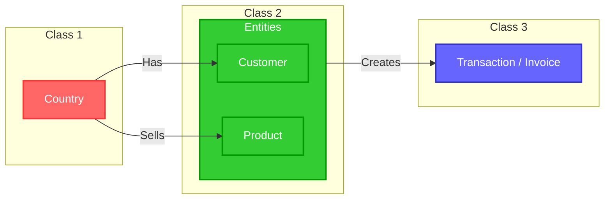

# customer_segmentation_analysis
The project is split into three parts:

- Determine the problems in this case by EDA techniques:
- Using Machine Learning to determine the optimized method to split customer segmentation and predict the churn
- Build The BI Dashboard for detecting insights

### Action items

| **Tools** | **Techniques** | **Description** |
| --- | --- | --- |
| **Python** | Cleaning Data | I will determine and handle the errors like missing values, duplicated records |
| **Python** | EDA & DA | I will filter and classify features into 3 class then focusing to detect the insight and the rule or non normal
Handling the canceled orders. Define the canceled rules |
| **Python** | Machine Learning | Machine Learning ( ML) help me t find the optimize to retrieve an optimized number of clustering for customer segmentation
ML is also used for determine who is potentially churn |
| **Power Bi** | BI Dashboard  | After using python, I will ETL the most optimized dataset and combine the another for visualizing the dashboard to easily evaluate the status of sale process |

## About Dataset

## Approach and Methodologies

### 1. Exploratory Data Analysis (EDA) and Feature Identification

### 1.1. Data Cleaning and Preprocessing

- Load and explore the dataset to identify key attributes.
- Detect and handle missing values, duplicate records, and potential outliers.
- Standardize attribute names and ensure data consistency.

```python
## Build Function: tab_info:
def tab_info(data):
    tab_info = pd.concat([
    pd.DataFrame(data.dtypes, columns=['column type']).T,
    pd.DataFrame(data.notnull().sum(), columns=['non-null count']).T,
    pd.DataFrame(data.isnull().sum(), columns=['null values (nb)']).T,
    pd.DataFrame(data.isnull().sum() / data.shape[0] * 100, columns=['null values (%)']).T
    ])
    return tab_info
```

### 1.2. Identifying Key Features and Entities

- Extract key entities and relevant metrics from the dataset.
- Define the core entities for CRM analysis:
    
    
    | **Entity** | **Attributes** |
    | --- | --- |
    | Country | Geographical location |
    | Invoice Number | Unique identifier for transactions |
    | Customer ID | Unique identifier for customers |
    | Product Code | Unique identifier for products |
    | Invoice Date | Transaction timestamp |
    | Product Description | Product details |
    | Quantity | Number of items in each transaction |
    | Unit Price | Price per unit of product |
- Categorizing these entities into three main classes:



### 2. Entity-Based Analysis

### **Class 1: Country-Level Transaction Analysis**

- Calculate the number of transactions per country.
- Identify high-performing countries based on revenue and transaction volume.
- Detect regional sales trends.

```python
# Enable Plotly to work offline in Jupyter Notebook
init_notebook_mode(connected=True)

# Define the choropleth map data
data = dict(
    ## Setting main board
    type= 'choropleth',  # Specifies the type of visualization (choropleth map)
    locations= countries.index,  # Country names (index of the 'countries' Series)
    locationmode= 'country names',  # Mode to match locations by country names
    z= countries,  # Data values corresponding to each country
    text= countries.index,  # Hover text (country names)

    ## Ensure colorbar is correctly defined
    colorbar = {'title':'Order nb.'},

    ## Change the color scale to Viridis
    colorscale = [
    [0, '#FFF2F2'],
    [0.33, '#A9B5DF'],  
    [0.66, '#7886C7'],  
    [1, '#2D336B']  
    ],
    reversescale = False
)
# Define the layout (appearance) of the map with increased size
layout = dict(
    title='Number of orders per country',  # Title of the map
    geo = dict(showframe = True, projection={'type':'mercator'}),
    width=900,  # Set width to 1200 pixels
    height=800   # Set height to 800 pixels
)

# Create the figure with data and layout
choromap = go.Figure(data=[data], layout=layout)

# Display the choropleth map
iplot(choromap, validate=False)

```

### **Class 2: Customer and Product Interaction Analysis**

- Explore customer purchasing behavior:
    - Purchase frequency per customer.
    - Average order value.
    - Customer segmentation using RFM (Recency, Frequency, Monetary) model.
- Evaluate product performance:
    - Best-selling products.
    - Products with high return/cancellation rates.
- Identify abnormal relationships such as:
    - High cancellation rates.
    - Customers with unusual shopping patterns.
- Defining the basic classification of items

### 3. Advanced Analytical Methods

### **3.1. Customer Segmentation and Clustering**

- Apply clustering algorithms (K-Means) to classify customers based on purchasing behavior.
- Use demographic data and purchase history to build customer personas.

### **3.2. Customer Behavior Prediction**

Develop classification models  to predict:

- Customer churn likelihood.
- High-value customers.

### 4. Visualization and Business Insights

- Develop dashboards showcasing key insights on customer behavior, transaction trends, and product performance.
- Create interactive charts to explore entity relationships.
- Provide strategic recommendations to optimize CRM:
    - Personalized marketing campaigns.
    - Customer retention strategies.
    - Inventory planning and demand forecasting.

---

### Next Steps:

- Integrate real-time CRM data for continuous monitoring.
- Enhance customer profiles using external data sources (social media, online interactions).
- Automate reports and anomaly detection using AI techniques.

---

This analytical framework provides a structured approach to CRM analysis, combining both descriptive and predictive insights while maintaining clarity and logical flow.
